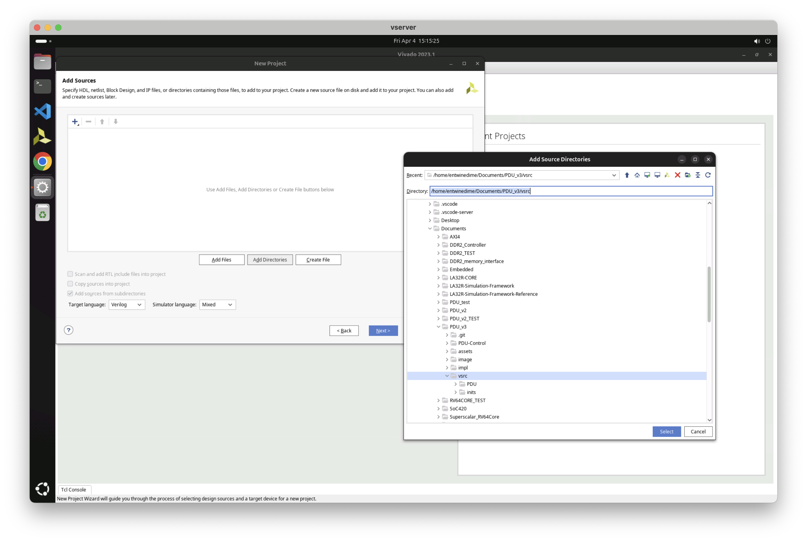
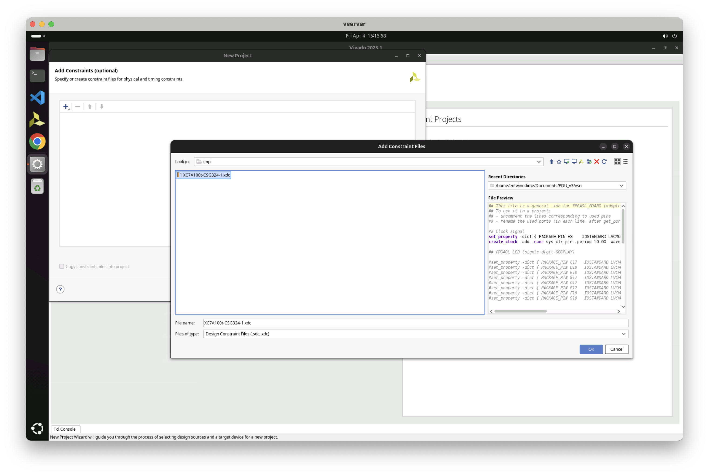
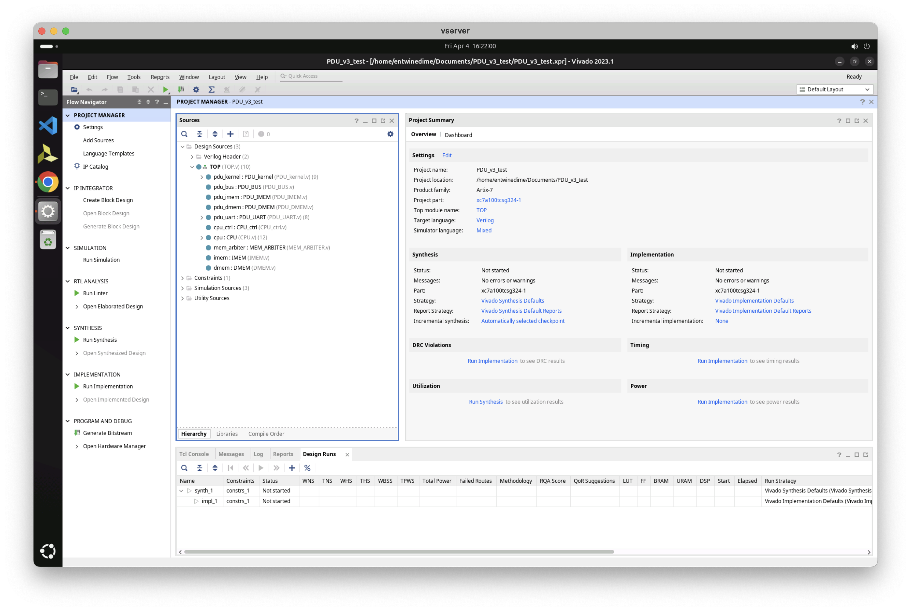
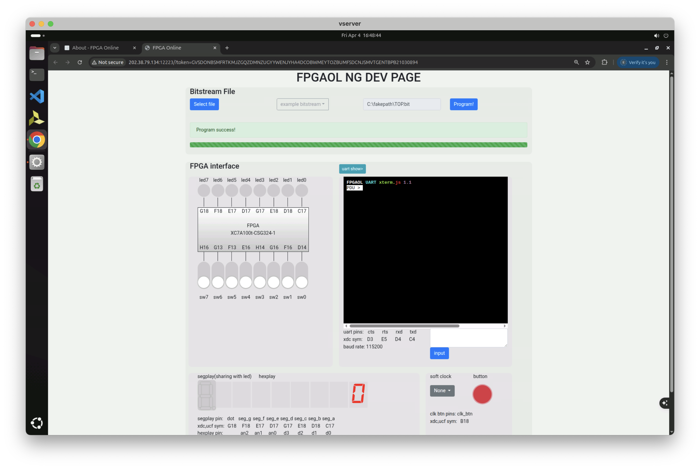
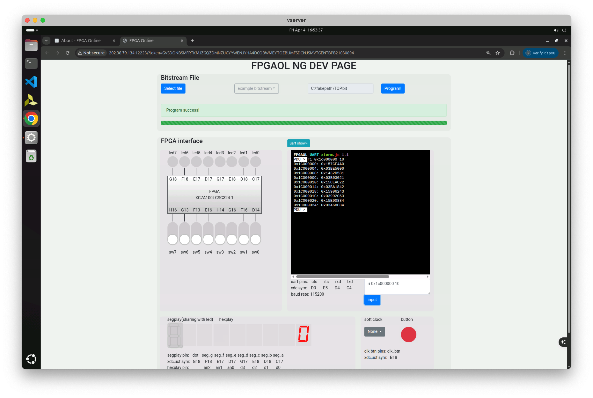

# PDU_v3

## 食用指南

### 1. 添加你自己的 CPU 代码

在 `PDU_v3/vsrc/PDU/CPU` 目录下创建 `your_cpu` 目录，并将你的 CPU 代码放在该目录下。不过你可以把你的 CPU 代码放在任何地方，只要你之后将其导入 Vivado 工程中即可。

假定你选择使用我们的框架，那么项目目录应当如下所示：

```
PDU_v3/
├── assets          // 一些非功能性附件
├── image           // PDU v3 的数据通路
├── impl            // .xdc 约束文件，包含 FPGAOL 与物理开发板
├── PDU-Control     // 用于生成 PDU 控制指令流的程序（也就是 pdu_inits 中的文件），无需处理
└── vsrc 
    ├── include     // Verilog 头文件，包括全局设置文件
    ├── inits       // CPU、PDU 的初始化 .ini 文件 
    ├── PDU
    │   ├── BUS     // PDU 总线实现
    │   ├── CPU     // CPU 设计实现
    │   │   ├── memory      // CPU 内存实现，上板可基于对应 .ini 文件初始化
    │   │   ├── your_cpu    // 自己的 CPU 相关文件。此文件夹需要自行创建，包含 CPU 及其内部模块
    │   │   └── CPU_ctrl.v  // CPU 与 PDU 的通信接口
    │   ├── Kernel  // PDU 核心实现
    │   ├── MEM     // PDU 内存实现
    │   └── UART    // PDU 串口实现
    └── TOP.v       // 项目的 TOP 文件，包含外设接口
```

### 2. 修改 `PDU_v3/vsrc/include/global_config.vh` 文件

打开 `PDU_v3/vsrc/include/global_config.vh` 文件，依照指引修改 `PDU_IMEM_FILE` 、 `PDU_DMEM_FILE` 、 `CPU_IMEM_FILE` 和 `CPU_DMEM_FILE` 四个路径宏定义

- `PDU_IMEM_FILE` 和 `PDU_DMEM_FILE`

    根据你实现的指令集，选择 `PDU_v3/vsrc/inits/pdu_inits` 下的 `loongarch` 和 `riscv` 文件夹，将两个宏定义分别定义为文件夹中 `pdu_imem.ini` 和 `pdu_dmem.ini` 的**绝对路径**，注意，路径应该以**字符串**表示，即需包含在两个双引号之间

- `CPU_IMEM_FILE` 和 `CPU_DMEM_FILE`

    在本框架中，可以在 `PDU_v3/vsrc/inits` 路径下找到 `cpu_inits` 文件夹，将 CPU 所用的初始化文件 `instr.ini` 和 `data.ini` 放入其中，然后将两个宏定义同样修改成两个文件的**绝对路径**即可，其实你可以把初始化文件放在任何地方，只要宏定义的绝对路径能正确找到 cpu 的两初始化文件即能正确实现

### 3. 创建 Vivado 工程

打开 Vivado 并且创建工程，在 **Add source** 界面下选择 **Add Directories** ，选择 `PDU_v3/vsrc` 目录添加，如果你的 CPU 代码不在 `PDU_v3/vsrc` 及其子目录下，你需要额外导入你的 CPU 代码文件



如果你在 FPGAOL 上部署，请在 **Add Constraints** 界面下选择添加 `PDU_v3/impl/XC7A100t-CSG324-1_FPGAOL.xdc` 约束文件；如果你在物理开发板上部署，请选择添加 `PDU_v3/impl/XC7A100t-CSG324-1_BOARD.xdc` 约束文件。自然，你需要选择 **xc7a100t-csg324-1** 型开发板。



创建完毕后，你的工程文件结构应该如下



### 4. 烧写工程

如果一切无误，你可以直接进行 **write bitstream** 操作，不出意外的话，你会得到 **WNS** 为 **-15.108ns** （甚至更糟），不要慌张，这是正常现象，你可以直接进行上板验证

## 操作指南

### 1. 上板操作

上板后，点击 button 可以发现串口输出了 `PDU:` 的字样，此时就可以进行命令输入了，所有命令的输入必须以**换行符结尾**，并且**对大小写敏感**



### 2. 支持的命令

**以下命令的 addr 支持十进制数和 "0x" 开头的十六进制数**

- `ri <addr.> [<count> = 1]`: 从 <addr.> 开始读取 `count` 条指令
- `wi <addr.> [<count> = 1]`: 从 <addr.> 开始写入 `count` 条指令
- `rd <addr.> [<count> = 1]`: 从 <addr.> 开始读取 `count` 条数据
- `wd <addr.> [<count> = 1]`: 从 <addr.> 开始写入 `count` 条数据
- `rr`: 读取所有寄存器
- `bs <addr.>`: 在 <addr.> 设置断点
- `bd <id>`: 清除编号为 <id> 的断点
- `bl`: 查看所有断点
- `step [<count> = 1]`: 单步执行 `count` 次
- `run`: 运行至 breakpoint 或 halt（否则会无法停止）
- `reset`: 重置 pc（不会重置寄存器和内存）

## 示例



